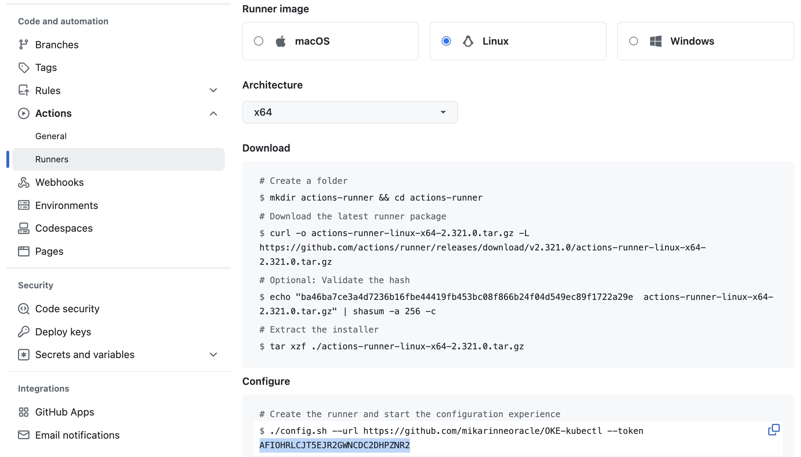
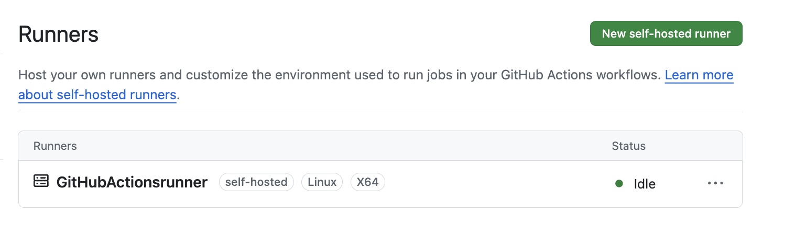
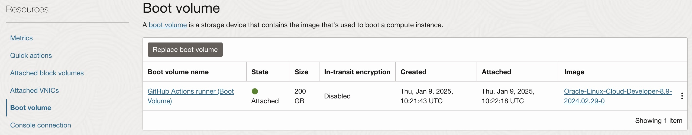

### Resource Manager Terraform Stack to create self-hosted GitHub Actions Runner on OCI

Benefits of using a self-hosted agent (besides using GitHub Actions pipeline tasks and oci scripting):
<ul>
    <li>Allows running <code>oci cli</code> scripting as <code>instance principal</code> that enables authentication and authorization via OCI <code>policies</code> without storing credentials on GitHub side</li>
    <li>Enables caching e.g. container images caching for fast builds</li>
</ul>

Deploy GitHub Actions Runner creation stack to OCI Resource Manager (Terraform) using the button below.

Stack then allows to configure the parameters for the Runner and VM creation:
<ul>
    <li>Runner and VM name</li>
    <li>GitHub repository url</li>
    <li>GitHub Actions runner token. Please note this is short-lived and needs to be generated from the GitHub project under <code>/settings/actions/runners</code> and clicking New Self-hosted runner -button (see the image below where the token is highlighted in light blue)</li>
    <li>Runner group name (default is 'Default')</li>
    <li>VM shape (OCPUs, memory and boot volume disk size)</li>
</ul>

 
You can delete the created resources at any time using stack <code>destroy</code> and re-create them again using the stack <code>apply</code>. Before re-creating it is advisable to delete the existing runner from the GitHub project. Multiple
runners can be set up by changing the default name <code>GitHubActionsrunner</code> of individual runners to something unique.

Terraform provider <code>oracle/oci</code> is installed so the created runner can be also used for Terraform pipelines.

Resource Manager Terraform takes a moment to complete and eventually the runner should appear in the GitHub project under <code>/settings/actions/runners</code>.

VM boot volume size is 200M by default that can be adjusted per build needs during the Terraform stack creation.

 
 
A bigger VM shape performs better. The defaults are 1 OCPU and 8GB memory that can be also adjusted during the Terraform stack creation.

